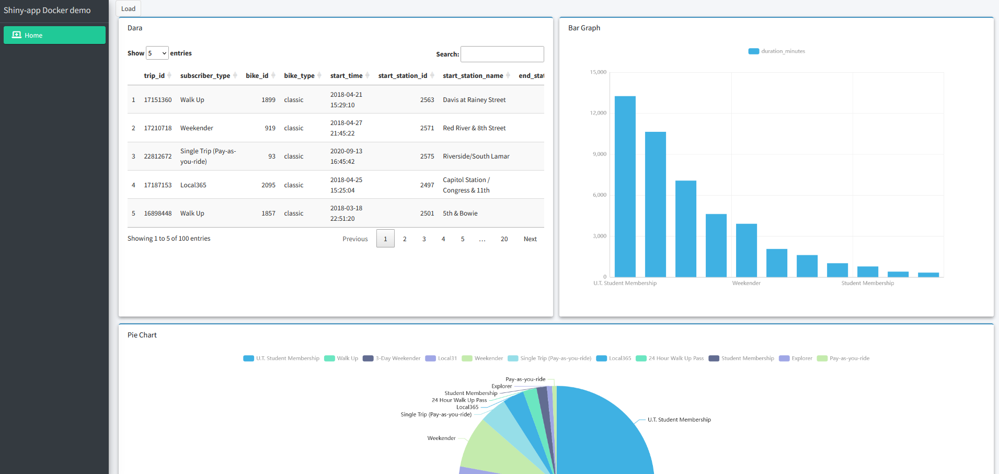

# Shiny apps en Docker

Este es un tutorial para ejecutar shiny-apps en el servicio Cloud Run de Google Cloud Platform.Para desplegar una shiny-app se utilizaran imagenes docker,la cual primero se testea de forma local y luego se migra a la nube.En este tutorial se asume que ya tienes instalada Docker,sin embargo a continuación te dejo el enlace para la descarga de [Docker](#0)

## Estructura

El siguiente proyecto considera como archivos y elementos principales,el archivo **Dockerfile**,la carpeta **mi_app**, y los archivos *shiny-server.conf* y *shiny-server.sh*.

El archivo Dockerfile sera con el que construiremos el contenedor,en cambio los otros archivos son necesarios para la ejecución de la shiny app.

``` docker
- 📁 Shiny_apps_docker
  - 📄 README.md
  - 📄 Dockerfile
    - 📁 mi_app
        - 📄 app.R
        - 🖼️ docker_1.png
        - 💹 trip_austin.csv        
  - 📄 shiny-server.conf
  - 📄 shiny-server.sh
  - 📄 .gitignore
  - 🖼 image_app.png
  - 🖼 image_repo_docker.png
  - 🖼 create_repo.png
  - 🖼 artifact_registry.png
  - 🖼 cloud_run_1.png
  - 🖼 cloud_run_2.png
  - 🖼 cloud_run_3.png
      
```

### Dockerfile

El archivo docker puede ser modificado segun el tipo de aplicación que se utilice.En este caso si deseas seguir trabajando con shiny apps,y agregar otras features,puedes agregar la instalación de otras librerias para R.

``` docker
# Descarga de una version de r del paquete tidyverse
FROM rocker/shiny-verse:latest

# Librerias de uso general
RUN apt-get update && apt-get install -y \
    curl \
    sudo \
    pandoc \
    pandoc-citeproc \
    libcurl4-gnutls-dev \
    libcairo2-dev \
    libxt-dev \
    libssl-dev \
    libssh2-1-dev\
    ## Limpieza
    && apt-get clean \
    && rm -rf /var/lib/apt/lists/ \
    && rm -rf /tmp/downloaded_packages/ /tmp/*.rds

# Instalar paquetes de r que sean necesarios
RUN R -e "install.packages('shiny', repos='http://cran.rstudio.com/')"

# Limpieza
RUN rm -rf /tmp/downloaded_packages/ /tmp/*.rds

# Copiar archivos de configuracion en la imagen docker
COPY shiny-server.conf  /etc/shiny-server/shiny-server.conf

# Copiar shiny app en la imagen docker
COPY mi_app /srv/shiny-server/

RUN rm /srv/shiny-server/index.html

# Habilitar el puerto 5000 para la shiny app
EXPOSE 5000

# Copiar el archivo de ejecucion de la shiny app en la imagen docker
COPY shiny-server.sh /usr/bin/shiny-server.sh

USER shiny

CMD ["/usr/bin/shiny-server"]
```

## Build

Para construir la imagen docker llamada shiny_app,se usa la siguiente linea.

``` docker
docker build -t shiny_app .
```

Si la imagen se construye bien,esta sera la que migremos a la nube.

## Run

Una vez lista la imagen shiny_app,ejecutamos la siguiente linea para ejecutar nuestra imagen dentro de un contenedor de forma local,la app tendra expuesto el puerto 5000.

``` docker
docker run -d -p 5000:5000 shiny_app 
```

## Acceso al contenedor

Si todos los pasos anteriores se desarrollaron de forma correcta,el contenedor se debe estar ejecutando en la siguiente dirección local.

[127.0.0.1:5000](http://127.0.0.1:5000)



## Migrar imagen Docker

Para migrar la imagen ya construida,primero debemos habilitar el servicio Artifact Registry en Google Cloud Platform.Si lo habilitamos de forma correcta deberiamos ver la siguiente pantalla.


Luego en este servicio debemos crear un repositorio,el cual puede ser creado desde la consola de GCP o desde el menu **Create Repository**.


Cuando creamos el repositorio elegimos el format como Docker,el mode como standar y la region en este caso la fijare en southamerica-west1[Santiago].Una vez creado el repositorio configuramos de forma local nuestro docker para poder hacer push o pull a las imagenes.

``` dockerfile
gcloud auth configure-docker southamerica-west1-docker.pkg.dev
```

Luego tenemos le tenemos que etiquetar a nuestra shiny_app con la ruta del directorio del repositorio de imagenes en la nube.

``` dockerfile
docker tag shiny_app:latest southamerica-west1-docker.pkg.dev/driven-saga-403916/docker-repo/shiny_app:latest
```

Una vez etiquetada la imagen,le podemos dar a push a la imagen con la siguiente linea

``` dockerfile
docker tag shiny_app:latest southamerica-west1-docker.pkg.dev/driven-saga-403916/docker-repo/shiny_app:latest
```

Si la imagen fue cargada correctamente la podremos ver en el repositorio de Artifact Registry como se ve en la imagen.


Como podemos ver en la imagen,ya tenemos la imagen de nuestra app shiny.De esta forma ahora la podemos desplegar con el servicio Cloud Run.

## Desplegar con Cloud Run

Una vez accedemos al servicio Cloud Run,tenemos que crear un servicio en donde se abrira el siguiente menu.


Desde el menu de configuracion del servicio tenemos que seleccionar en la primera opcion **Container image URL**,la ruta en donde se encuentra nuestra imagen en el repositorio,luego asignamos el **Service Name** y la **Region**.

Mas abajo seleccionamos el valor de 1 en la opcion **Minimum number of instances**,para que el primer despliegue no sea tan lento.

Ademas en el menu **Authentication**,seleccionamos la opcion ***Allow unauthenticated invocations***

Finalmente en el ultimo modulo de configuracion seleccionamos el valor de 5000 en la opcion **Container port**,que corresponde al puerto asignamos en el dockerfile.

Si la imagen se despliega de forma correcta,la deberiamos poder ver como se ve en la imagen.


Finalmente si queremos acceder al servicio,podemos entrar al URL que se nos muestra en la imagen.

Se los dejo a continuación.

<https://shiny-app-vvrixyvk3q-uc.a.run.app>

Aca se una vista de la shiny app.


